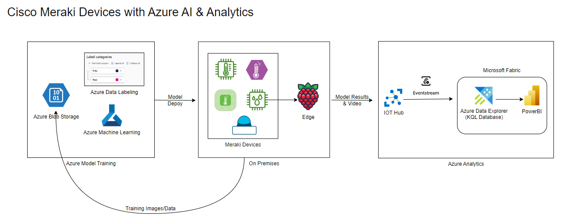

# Custom Computer Vision on Azure for Meraki MV Camera

This tutorial guides you through the process of capturing images, labeling a dataset, training a custom object detection model and deploying to a Meraki MV camera using Azure Machine Learning and Python.  

You can also analyze data from the device and the results of custom object detection model by streaming to the cloud using Azure IoT Hub, Microsoft Fabric Eventstream, Azure KQL Database, and PowerBI visualizations.



# Prerequisites

1. Cisco Meraki MV 2nd Generation Camera (MV2, MV12, MV32, MV22, MV72)
2. Software version 4.18 on the camera
3. Microsoft Azure Subscription
4. A micro computer with Linux distribution.  This demo used a Raspberry PI 4 device running the Bullseye Raspberry Pi OS 

# Steps to Complete

**Step 1.** [Image Capture](#image_capture).  Use the Meraki MV Camera to capture images to use for training a custom object detection model.

**Step 2.** [Labeling](#labeling). Use the Azure Machine Learning labeling project to prepare the data.

**Step 3.** [Train Custom Object Detection Model](#custOD). Train an object detection model using Azure Machine Learning Notebooks.

**Step 4.** [Deploy](#deploy). Use the Cisco Meraki Dashboard to deploy the model to the Meraki MV Camera.

**Step 5.** [Stream to Azure](#azure). Setup streaming services to Azure so data from the camera can be analyzed and visualized.

**Step 6.** [Analyze](#fabric). Leverage the data on the cloud for analytics, visualization and automation such as event alerts.


<a name="image_capture"></a>

# Step 1: Image Capture

The first step is to capture a set of images to use for training a custom object detection model.  

## Tips for Image Capture
*   Capture enough images to include a minimum of 50 examples of each class to be detected - but the more the better.  

* Keep the ratio between the most and least frequently captured classes below 2 to 1.

* The more classes you have, the more individual samples per class you will need.  If you have more than 50 classes, you would want a minimum of 200 examples of each class.

* It's helpful to capture images with different lighting, settings, and combinations that are relevant to the scenario the model would be used in.

* Place the objects in different orientations, positions, locations, and include some objects that you do NOT want to detect as well.  Also, you may want to partially obscure some of the objects as well, by blocking with other objects or not being in completely in the frame.

For more information and suggestion see: [Improve your Custom Vision Model](https://learn.microsoft.com/en-us/azure/ai-services/custom-vision-service/getting-started-improving-your-classifier).

## Using the Meraki Camera

The [cvSnapper.py](image_capture/cvSnapper.py) script uses a Meraki camera to take snapshots of objects within the frame. 

First, set the following values In the [config.py](image_capture/config.py) file:

1. `api_key` is your Meraki Dashboard API Key. If you don't know how to generate one, follow the instructions in this [article](https://documentation.meraki.com/General_Administration/Other_Topics/Cisco_Meraki_Dashboard_API).

2. `camera_serial` is the serial number of the camera you will be working with.

3. `desired_snaps` is the number of snapshots you wish to take to construct your dataset. The more the better, especially if you want to be able to recognize many different classes, but you should see decent accuracy with around 100 images and 4 classes total.

4. `dataset_name` is how you want to name your dataset.  For example, `meraki_images`.

5. `train_test_split` is the percentage of images in the dataset that will be used for training, while the remaining ones will be used for testing.

Once you have completed setting up the `config.py`, the next steps setup the environment and snapshot script. 

1.  In line `12` of the `cvSnapper.py` script, change the `win_or_mac` variable to `mac` or `win` depending on your environment.

2. Run `pip install -r requirements.txt` to install the required Python libraries before proceeding (in the image_capture directory of this repo).

When you're ready and you have positioned the camera and objects you wish to use in the desired location and position, you can run the script with `python cvSnapper.py`.

The script will do the following:

1. It will create a directory structure in the form:

```
images/
|_train/
|_test/
```

2. It will prompt you with `Press Enter to capture snapshot:`, and after you press Enter (with no other input), it will generate a Snapshot from the camera you chose. It can be useful to have a Meraki Dashboard video stream of the camera open side by side to know what the camera is looking at before you request the snapshot and make any necessary adjustments.

3. It will then ask you if you want to `Keep image? (Y/N):` . If you answer `Y` it will increase the snap counter, and save the image as `snap_{snap_count}.jpg` in the images folder.
4. If you answer `N`, it will discard the image and ask you if you wish to continue or not. If you answer `Y`, it will prompt you again to take a new snapshot, and if you answer `N` it will exit the program
5. The script will continue fetching snapshots until the counter reaches your `desired_snaps` setting, and you have the desired number of images.
6. After this, the script will randomly split your captured images according to your specified `train_test_split` and will place them in the `train` and `test` folders.

<a name="labeling"></a>

# Step 2: Labeling

Once you have captured the images, use the **Azure Machine Learning Labeling Project** to prepare the dataset for training.   

For general information about this service please see [Image labeling capabilities](https://learn.microsoft.com/en-us/azure/machine-learning/how-to-create-image-labeling-projects?view=azureml-api-2#image-labeling-capabilities.
).

Detailed instructions for this tutorial are [here](labeling/README.md).

<a name="custOD"></a>

# Step 3: Train a Custom Object Detection Model

With the labeled images and an annotations file available from the previous step, you are ready to train a custom object detection model using transfer learning. 

We will be leveraging a pre-trained TensorFlow model, specifically the SSD Mobilenet V2 Object Detection model with FPN-Lite feature extractor.  The process we'll follow includes preparing the data, training the model, and evaluating the results.  Once our model is trained and evaluated, we'll convert it to TFLite format. This conversion allows the model to be deployed on the Meraki Camera. 

Detailed instructions for training the model are [here](object-detection/README.md).

<a name="deploy"></a>

# Step 4: Deploy Model to Meraki Camera

After completing the steps to train your custom Object Detection model and exported model file prepared you can deploy the model to a Meraki Camera using the Cisco Meraki Dashboard. 

Detailed instructions can be found in the [MV Sense Custom Computer Vision](https://documentation.meraki.com/MV/Video_Analytics/MV_Sense_Custom_Computer_Vision) documentation.

<a name="azure"></a>

# Step 5: Setup Streaming to Azure

The next step is to scale from the Meraki Camera to Azure for additional Analytics and Visualization on data collected on the camera, including the output of the custom Object Detection model running on the camera.  This is enabled by streaming data from the Meraki Camera to Azure.

## Setup Azure Services

1. Follow the instructions to [Create an IOT Hub](https://learn.microsoft.com/en-us/azure/iot-hub/iot-hub-create-through-portal#create-an-iot-hub) service on Azure.

2. Follow the instructions to [Register a new device in the IoT hub](https://learn.microsoft.com/en-us/azure/iot-hub/iot-hub-create-through-portal#register-a-new-device-in-the-iot-hub) representing your mosquitto broker.

## Create Bridge from Device to Azure

Once you have set up those services on Azure, you will create the bridge from the Meraki device to Azure.  Step by step instructions can be found [here](azure/README.md).

<a name="fabric"></a>

# Step 6: Analyze, Visualize & Automate using Azure Data Fabric 

Now that we can stream the data to Azure, we can use Azure Data Fabric to do Real-Time Analytics, Visualize our data using Copilot assistance, and orchestrate automation based on events detected in the data.   Step by step instructions to set this up are available [here](fabric/README.MD).