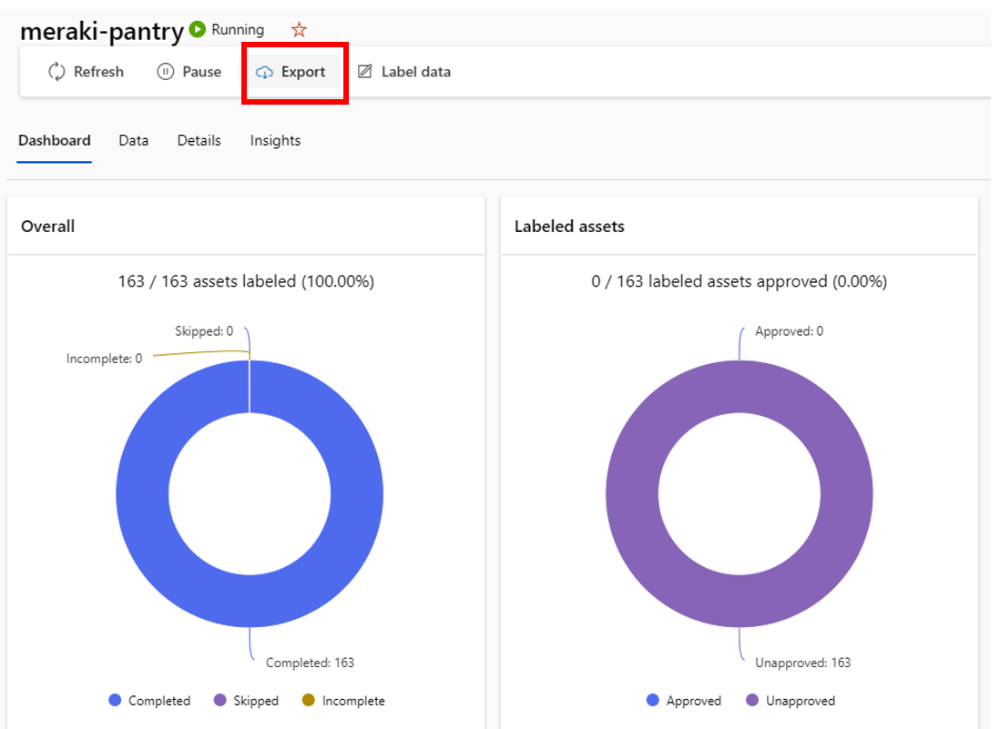
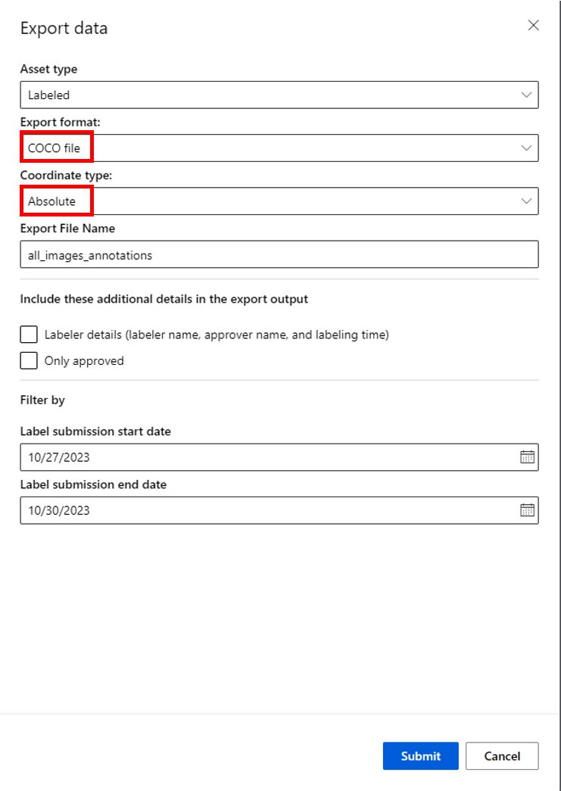

# Set up an Image Labeling Project and Export Labels

## Prerequisites
* The data that you want to label, either in local files or in Azure Blob Storage.
* An Azure subscription. If you don't have an Azure subscription, create a [free account](https://azure.microsoft.com/free/) before you begin.
* An Azure Machine Learning workspace. See [Create an Azure Machine Learning workspace](https://learn.microsoft.com/en-us/azure/machine-learning/how-to-manage-workspace?view=azureml-api-2).

## Setup Project

Create an image data labeling project in Azure Machine Learning Studio. 

Detailed instructions are here: [Set up an image labeling project and export labels](https://learn.microsoft.com/en-us/azure/machine-learning/how-to-create-image-labeling-projects?view=azureml-api-2), and the instructions below show some specific settings for this tutorial.

### Step 1: Project Details

Make sure to Select Object Identification for the bounding box indicating location of the object.

### Step 2:  Add Workforce

Press "Next" without selecting an option to skip this optional step (unless you plan to use a workforce service for labeling).

### Step 3: Select or Create Data

For this step, we will upload the images captured in the first section of the Tutorial.

First, select the option to Create a datasource.

Name your data asset.  The type should default to File.

Choose **From local files** to upload the images captured by the camera.  

Use the default storage associated with your Azure Machine Learning service, called **workspaceblobstorage**.

The upload path should be set for you.  Select the **Upload** button and navigate to where you stored the images captured by the camera.

Upload the images (**NOTE:** this can take a while!)

Then select the datastore you just created.

### Step 4 - Incremental Refresh

For this tutorial leave this option unenabled and select `Next`.

If you plan to add additional images to the directory regularaly you can enable incremental refresh to automatically add them to the labeling project.  For more information, see [Configure incremental refresh](https://learn.microsoft.com/en-us/azure/machine-learning/how-to-create-image-labeling-projects?view=azureml-api-2#configure-incremental-refresh).

### Step 5 – Label categories

Select the `+ Add label category` and enter each class you want to train the model to detect.  This tutorial doesn't use subclasses, you will just repeat the process to add a label for each class.

### Step 6 – Labeling instructions

For this tutorial, you can skip this step by selecting `Next`.  If you plan to have a workforce or other people assist with labeling you might add instructions here.

### Step 7 – Quality control 

For this tutorial, you can skip this step by selecting `Next`.  If you wanted to add mulitple labelers and quality checks you could configure this, more information is available [here](https://learn.microsoft.com/en-us/azure/machine-learning/how-to-create-image-labeling-projects?view=azureml-api-2#quality-control-preview).

### Step 8 - ML assisted labeling

Machine Learning (ML) assisted labeling triggers training of automatic machine learning models once you have submitted enough manually labeled classes/images.  The model is then used to prelabel the remaining images in the dataset to speed up the process.

To set this up:

* Select `Enable ML assisted labeling`
* For `Compute target` select `Customize`.  If you already have a GPU cluster configured you may select it, but otherwise select `Create`

You may select the option for dedicated or low priority compute for your GPU cluster.  For this tutorial you may want to use Low priority as it's more cost effective for testing/development scenarios where guaranteed through put isn't critical.

Depending on what region you've setup  your Azure Machine Learning Service, "Low priority"" may be the only option. 

If you do not see any options, you could select a location in a nearby region, or you can request additional quota for GPU machines.

In the `Advanced Settings` tab setup the name of your cluster and you can configure the number of nodes you'd like your cluster to consume and the number of seconds before it spins down.  The default options are fine for this Tutorial.

Once you have setup the GPU cluster you created it should populate into the drop-down list.  

You can also specify the confidence threshold for pre-labeling; the default of 0.8 (80%) confidence should be fine for this tutorial.

Small object detection is not required, leave this unenabled.

Select `Create project` to complete the setup.  It will take a few minutes to create and initialize the project.  You'll be notified one it's complete.

### Next Steps

Once the labeing project has been intialized, open the project, then select the `Details` menu. 

Confirm that you have compute selected for both training and inferencing.

Select `ML assisted labeling` and enable to option for `Attempt pre-labeing of manual tasks` and `Save`.

Now you're ready to begin labeling!  Step by step instructions are here: [Run and monitor the project](https://learn.microsoft.com/en-us/azure/machine-learning/how-to-create-image-labeling-projects?view=azureml-api-2#run-and-monitor-the-project).

Go to the `Dashboard`, this is the main location to track your labeling progress.  You will see a `task queue`, that indicates how many labels are required to automatically trigger a training run of the Auto Machine Learning.  

Example of a task queue for a new project with 162 image files, before any labeling.

Once you have labeled about 25-30 examples of each class, you could also return to the `Details` section and select `On-demand training` if you want to start the AutoML sooner.

Select the `Label data` option from the top menu.

The images in your dataset will be available for labeling.  Draw bounding boxes around each object in your image and select the correct Tag (class label) for each object.

For more information see [Tag images and specify bounding boxes for object detection](https://learn.microsoft.com/en-us/azure/machine-learning/how-to-label-data?view=azureml-api-2#tag-images-and-specify-bounding-boxes-for-object-detection).

Once you have completed the number required to trigger pre-labeling, you may want to stop and let the model training and inference/pre-labeling run.  Depending on the GPU cluster configuration, this may take from 10-30 minutes.  For more information, see [Pre-labeling](https://learn.microsoft.com/en-us/azure/machine-learning/how-to-create-image-labeling-projects?view=azureml-api-2#pre-labeling) and [Start an ML-assisted labeling task](https://learn.microsoft.com/en-us/azure/machine-learning/how-to-create-image-labeling-projects?view=azureml-api-2#start-an-ml-assisted-labeling-task).

From the project dashboard, you can track the progress for the jobs that run for auto-labeling in the `ML assisted labeling experiments`.  Once the Inference job is complete, you will se the number of images that could be prelabeled as well.

When you return to the labeling project after pre-labeling, any object that could be determined by the model based on the accuracy threshold (default of 80%) will have a bounding box around it.  You can submit/accept it, edit the box or class, or remove the box completley if it's inaccurate.

In the example below, the Pasta object was labeled correctly, but an inaccurate class was assigned (Mac N Cheese) as well. 

Once you have completed the labeling process for all the images, you will export the label information for use in training models. From the main Project page of your labeling project, select the Export button.

You can export an image label as:

- A CSV file. Azure Machine Learning creates the CSV file in a folder inside Labeling/export/csv.
- A COCO format file. Azure Machine Learning creates the COCO file in a folder inside Labeling/export/coco.
- An Azure MLTable data asset.

For more information, see [Export the labels](https://learn.microsoft.com/en-us/azure/machine-learning/how-to-create-image-labeling-projects?view=azureml-api-2#export-the-labels).

For this tutorial, export to the COCO file.

