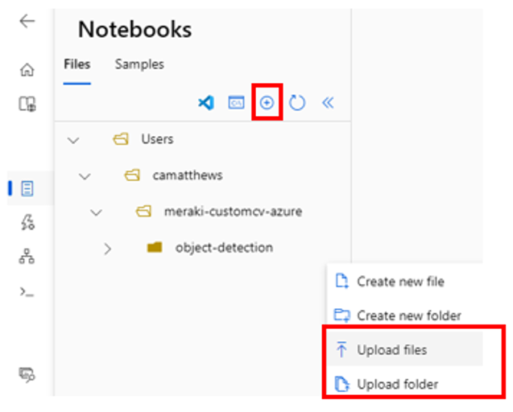

# Train a Custom Object Detection Model

Now that we have a set of labeled images we are ready to train a custom object detection model using transfer learning. We will be leveraging a pre-trained TensorFlow model, specifically the SSD Mobilenet V2 Object Detection model with FPN-Lite feature extractor.

The process we'll follow includes preparing the data, training the model, and evaluating the results.  Once our model is trained and evaluated, we'll convert it to TFLite format. This conversion allows our model to be deployed on edge devices, which are often constrained by factors such as processing power and memory. 

**NOTE:** The training dataset used for this example consisted of 163 images of items found in a pantry, with 4 classes that were used to fine-tune the model, adapting it to our specific use-case.  This dataset and annotations file is provided in the repo in the `sample-data` folder.  However, you can follow along with your own set of images as well.

First, follow the instructions here to setup your Compute Environment, then use the [Object_Detection_Model](Object_Detection_Model.ipynb) notebook provided in this repo for the rest of the steps.

# Compute Setup 

The steps in this section only need to be executed the first time you are using Azure Machine Learning to complete this demonstration.

## Prerequisites

1. An **Azure Machine Learning Workspace.**  See [Tutorial: Create resources you need](https://learn.microsoft.com/en-us/azure/machine-learning/quickstart-create-resources?view=azureml-api-2) to create a new AML Workspace.  If you completed the steps in **Step 2: Labeling** you should reuse that workspace, you do not need to create another one.

2. A **GPU Compute Instance in Azure Machine Learning.**   See [What is an Azure Machine Learning oompute instance](https://learn.microsoft.com/en-us/azure/machine-learning/concept-compute-instance?view=azureml-api-2#create) for more information.  See these steps to [Create](https://learn.microsoft.com/en-us/azure/machine-learning/how-to-create-compute-instance?tabs=azure-studio&view=azureml-api-2#create) your compute instance.  Some regions will have more (or less) availability of GPU options, see the documentation (link above) for the most recent information.  You will not need a high powered GPU for this tutorial, feel free to select less expensive options.  
    
    **NOTE:** Make sure the [Idle Shutdown](https://learn.microsoft.com/en-us/azure/machine-learning/how-to-create-compute-instance?tabs=azure-studio&view=azureml-api-2#configure-idle-shutdown) is configured for your Compute to reduce costs when not in use.  This in the Advanced Settings.

3.  We will primarily use Jupyter Notebooks, please see [Run Jupyter notebooks in your workspace](https://learn.microsoft.com/en-us/azure/machine-learning/how-to-run-jupyter-notebooks?view=azureml-api-2) to familiarize yourself with the environment.


4. **Clone this repository** into your Azure Machine Learning Worksplace file system, by following these [instructions](https://learn.microsoft.com/en-us/azure/machine-learning/concept-compute-target?view=azureml-api-2#azure-machine-learning-compute-managed).   Optionally, you can manually create folders and upload the files from the `object-detection` section of the repo to your workspace from within the Notebooks UI using the `Upload Files` or `Upload Folder` option.  The path should be 
`Users/{your_user_name}/meraki-customcv-azure/object-detection`.

<p align="center">
  
</p>

## Create Virtual Environments/Kernels

You will run these commands from the Terminal on the compute you created in the prerequisites, see [How to access terminal](https://learn.microsoft.com/en-us/azure/machine-learning/how-to-access-terminal?view=azureml-api-2) for details from within Azure Machine Learning. 

We will create two virtual environments and kernels.  The first, we create using the **workstation_env_TF_2_5.yml** file provided in the repo with the commands given.  If you'd like more information, please reference [AML Environment for Notebook](https://learn.microsoft.com/en-us/azure/machine-learning/tutorial-cloud-workstation?view=azureml-api-2)

The second environment is a clone of the first as we start with the same set of libraries, but as we will work in this environment/kernel for model training updates to the library versions will happen in it.  

We will only switch to the "Tensorflow 2.5" environment/kernel when we export models to tflite, so it will remain unchanged.

```
cd meraki-customcv-azure/object-detection

conda env create -f workstation_env_TF_2_5.yml

conda activate TF_2_5

python -m ipykernel install --user --name TF_2_5 --display-name "Tensorflow 2.5"

conda deactivate
```

The second environment is a clone of the first.

```
conda create --name TF --clone TF_2_5 

conda activate TF

python -m ipykernel install --user --name TF --display-name "Tensorflow"
```

## Install TensorFlow ObjectDetection API & Required Libraries

Continuing in the terminal console, we will install the TensorFlow Object Detection API.  For more information, see [Object Detection API with TensorFlow 2](https://github.com/tensorflow/models/blob/master/research/object_detection/g3doc/tf2.md)

Create a directory for the standard TensorFlow objects.

```
mkdir -p Tensorflow

cd Tensorflow
```

Activate the correct environment if needed (was done in previous step):

```
conda activate TF
```

Clone the repo to the Tensorflow directory.

```
git clone https://github.com/tensorflow/models.git

```

Setup, compile and install the components required.

```
cd models/research

protoc object_detection/protos/*.proto --python_out=.

cp object_detection/packages/tf2/setup.py .

python -m pip install .

sudo apt install --allow-change-held-packages libcudnn8=8.1.0.77-1+cuda11.2

pip install tensorflow-gpu

```
You may see error messages related to the python version when you install tensorflow-gpu; just ignore and let finish so the pre-trained models can execute.  Once it completes you will also see some dependency errors, you can ignore those as well.

Run the following script to check the installation (see [Test your Installation](https://tensorflow-object-detection-api-tutorial.readthedocs.io/en/latest/install.html#test-your-installation) from the TensorFlow 2.0 Object Detection API documentation.)  You should be in the `Tensorflow/models/research` directory.

```
python object_detection/builders/model_builder_tf2_test.py
```

It should take a minute or so to run and produce output ending in something like:

```
INFO:tensorflow:time(__main__.ModelBuilderTF2Test.test_unknown_meta_architecture): 0.0s
I0620 00:18:50.213680 140287938955072 test_util.py:2467] time(__main__.ModelBuilderTF2Test.test_unknown_meta_architecture): 0.0s
[       OK ] ModelBuilderTF2Test.test_unknown_meta_architecture
[ RUN      ] ModelBuilderTF2Test.test_unknown_ssd_feature_extractor
INFO:tensorflow:time(__main__.ModelBuilderTF2Test.test_unknown_ssd_feature_extractor): 0.0s
I0620 00:18:50.214586 140287938955072 test_util.py:2467] time(__main__.ModelBuilderTF2Test.test_unknown_ssd_feature_extractor): 0.0s
[       OK ] ModelBuilderTF2Test.test_unknown_ssd_feature_extractor
----------------------------------------------------------------------
Ran 24 tests in 42.798s
```

If you get a failure message, try restarting your Terminal, then rerun the test.

Once the test completes you are ready to move on to building a custom Object Detection model.  The next steps will be run from the [Object_Detection_Model.ipynb](Object_Detection_Model.ipynb) notebook.
